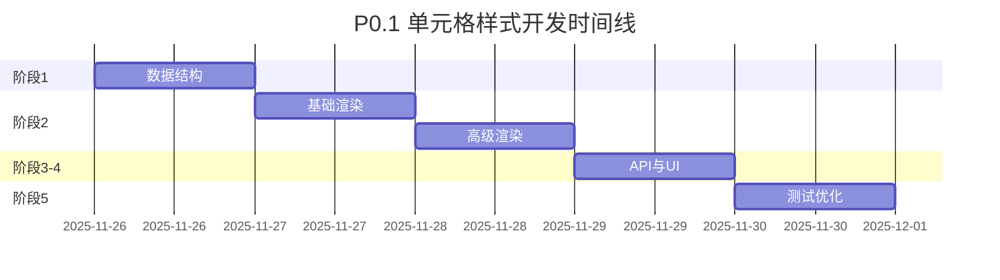

# 🎨 P0.1 单元格样式 - 开发概览

> **任务**: 实现完整的单元格样式系统  
> **时间**: 5 天 (2025-11-26 → 2025-11-30)  
> **状态**: 🟡 准备就绪，等待开始

---

## 📚 文档导航

| 文档 | 用途 | 何时查看 |
|------|------|----------|
| **[P0.1-CELL-STYLES-PLAN.md](./P0.1-CELL-STYLES-PLAN.md)** | 详细开发计划 (900+ 行) | 开始开发前完整阅读 |
| **[P0.1-CHECKLIST.md](./P0.1-CHECKLIST.md)** | 开发检查清单 | 每天开始和结束时检查 |
| **[P0.1-QUICK-REF.md](./P0.1-QUICK-REF.md)** | 快速参考卡片 | 开发过程中随时查阅 |
| **本文档** | 开发概览 | 快速了解全貌 |

---

## 🎯 要实现的功能

### 12 个核心样式属性

```
字体样式 (6)          颜色 (2)           对齐 (2)           高级 (2)
├─ 字体 fontFamily   ├─ 字体颜色 color   ├─ 水平 textAlign    ├─ 换行 wrapText
├─ 字号 fontSize     └─ 背景色 bgColor  └─ 垂直 vAlign      └─ 旋转 rotation
├─ 粗体 bold
├─ 斜体 italic
├─ 下划线 underline
└─ 删除线 strike
```

### 实际效果示例

```
┌──────────────────────────────────────┐
│  Arial 12px      粗体 16px   斜体   │  ← 字体样式
│  红色文字      黄色背景    下划线   │  ← 颜色和装饰
│  ←左对齐    居中对齐→    右对齐→    │  ← 水平对齐
│  ↑顶部   →中部↓   底部↓              │  ← 垂直对齐
│  长文本自动换行显示在多行内容...   │  ← 自动换行
└──────────────────────────────────────┘
```

---

## 📅 5 天开发路线图



### 每日关键产出

| Day | 日期 | 核心产出 | 文件 |
|-----|------|----------|------|
| 1 | 11-26 | 类型定义 + 数据模型 | `types.ts`, `SheetModel.ts` |
| 2 | 11-27 | 字体渲染 + 文本装饰 | `renderCells.ts` |
| 3 | 11-28 | 对齐 + 背景 + 换行 | `renderCells.ts` |
| 4 | 11-29 | API + 工具栏 + 快捷键 | `api.ts`, `StyleToolbar.vue`, `events.ts` |
| 5 | 11-30 | 测试 + 优化 + 文档 | `styles.spec.ts` |

---

## 🏗️ 技术架构

```
┌─────────────────────────────────────────┐
│           StyleToolbar.vue              │  ← UI 层（工具栏）
│     [字体] [B] [I] [U] [颜色]           │
└──────────────────┬──────────────────────┘
                   │ 调用 API
┌──────────────────▼──────────────────────┐
│              SheetAPI                    │  ← API 层
│  setCellStyle() / getCellStyle()        │
└──────────────────┬──────────────────────┘
                   │ 操作数据
┌──────────────────▼──────────────────────┐
│            SheetModel                    │  ← 数据层
│  cellStyles: Map<string, CellStyle>     │
└──────────────────┬──────────────────────┘
                   │ 读取数据
┌──────────────────▼──────────────────────┐
│           renderCells.ts                 │  ← 渲染层
│  Canvas 2D Context 绘制                  │
└──────────────────────────────────────────┘
```

---

## 💻 核心代码示例

### 1. 类型定义 (Day 1)
```typescript
interface CellStyle {
  fontFamily?: string
  fontSize?: number
  bold?: boolean
  italic?: boolean
  underline?: boolean | 'single' | 'double'
  strikethrough?: boolean
  color?: string
  backgroundColor?: string
  textAlign?: 'left' | 'center' | 'right'
  verticalAlign?: 'top' | 'middle' | 'bottom'
  wrapText?: boolean
  textRotation?: number
}
```

### 2. 数据存储 (Day 1)
```typescript
class SheetModel {
  private cellStyles = new Map<string, CellStyle>()
  
  setCellStyle(row: number, col: number, style: Partial<CellStyle>) {
    const key = `${row},${col}`
    const current = this.cellStyles.get(key) || {}
    this.cellStyles.set(key, { ...current, ...style })
  }
}
```

### 3. 渲染实现 (Day 2-3)
```typescript
function renderCellContent(ctx, cell, style, x, y, width, height) {
  // 1. 背景色
  if (style.backgroundColor) {
    ctx.fillStyle = style.backgroundColor
    ctx.fillRect(x, y, width, height)
  }
  
  // 2. 设置字体
  ctx.font = `${style.italic ? 'italic ' : ''}${style.bold ? 'bold ' : ''}${style.fontSize}px ${style.fontFamily}`
  ctx.fillStyle = style.color
  
  // 3. 绘制文本
  ctx.fillText(cell.value, textX, textY)
  
  // 4. 下划线/删除线
  if (style.underline) drawUnderline(ctx, ...)
  if (style.strikethrough) drawStrikethrough(ctx, ...)
}
```

### 4. API 调用 (Day 4)
```typescript
// 用户代码
api.setCellStyle(0, 0, {
  bold: true,
  fontSize: 16,
  color: '#FF0000'
})

// 快捷方法
api.setBold(0, 0, true)
api.setTextColor(0, 0, '#FF0000')
```

---

## ✅ 验收清单

### 功能完整性
- [ ] 12 个样式属性全部实现
- [ ] 样式正确渲染到 Canvas
- [ ] 工具栏操作正常
- [ ] 快捷键响应（Ctrl+B/I/U）
- [ ] 撤销重做功能

### 质量标准
- [ ] 单元测试覆盖率 > 80%
- [ ] 1000 单元格渲染 < 50ms
- [ ] 无 TypeScript 类型错误
- [ ] 代码通过 ESLint

### 文档完善
- [ ] API 文档更新
- [ ] 使用说明完整
- [ ] 代码注释清晰

---

## 🚀 快速开始

### 第一步：创建开发分支
```bash
git checkout -b feature/p0.1-cell-styles
```

### 第二步：阅读详细计划
打开 `docs/P0.1-CELL-STYLES-PLAN.md`，完整阅读阶段 1 的内容。

### 第三步：开始 Day 1 开发
1. 编辑 `src/components/sheet/types.ts`
2. 定义 `CellStyle` 接口
3. 编辑 `src/lib/SheetModel.ts`
4. 添加样式存储和方法

### 第四步：运行测试
```bash
npm test
```

### 第五步：提交代码
```bash
git add .
git commit -m "feat(styles): Day 1 - 完成数据结构定义"
git push origin feature/p0.1-cell-styles
```

---

## 📊 进度追踪

### 当前状态
```
Day 2/5 (50%) - ✅ 基础渲染完成
```

### 实际里程碑
- ✅ Day 1 结束: 20% (数据结构完成) - 2025-11-26
- ✅ Day 2 结束: 50% (基础渲染完成) - 2025-11-26
- ⏳ Day 3 进行中: 70% (高级功能开发)
- Day 4 计划: 90% (UI 和 API 完成)
- Day 5 计划: 100% (测试和优化完成)

---

## 🎯 成功标准

当以下所有条件满足时，P0.1 开发完成：

1. ✅ 12 个样式属性全部实现并可用
2. ✅ 在 Canvas 上正确渲染各种样式
3. ✅ 工具栏组件完成并集成
4. ✅ 快捷键支持（Ctrl+B/I/U）
5. ✅ 撤销重做功能正常
6. ✅ 单元测试覆盖率 > 80%
7. ✅ 性能测试达标（1000 单元格 < 50ms）
8. ✅ 所有手动测试场景通过
9. ✅ 文档更新完成
10. ✅ 代码审查通过并合并到 main

---

## 💡 重要提示

### 开发建议
- 📖 **先读计划**: 开始前完整阅读 `P0.1-CELL-STYLES-PLAN.md`
- ✅ **每日检查**: 使用 `P0.1-CHECKLIST.md` 追踪进度
- 📋 **随时参考**: 开发时查阅 `P0.1-QUICK-REF.md`
- 🧪 **边写边测**: 每个函数完成后立即编写测试
- 💾 **频繁提交**: 每完成一个小功能就提交

### 常见陷阱
- ⚠️ Canvas 下划线需要手动绘制，不是原生支持
- ⚠️ 字体字符串格式必须严格遵守规范
- ⚠️ 文本测量 (measureText) 需要在设置 font 之后
- ⚠️ 样式合并要注意不要覆盖现有属性
- ⚠️ Map 的 key 必须一致（统一使用 `row,col` 格式）

---

## 📞 帮助资源

### 项目内部
- [架构文档](./ARCHITECTURE.md)
- [API 参考](./API_REFERENCE.md)
- [开发指南](./DEVELOPER_GUIDE.md)

### 外部资源
- [Canvas API - MDN](https://developer.mozilla.org/en-US/docs/Web/API/Canvas_API)
- [Canvas Text - MDN](https://developer.mozilla.org/en-US/docs/Web/API/CanvasRenderingContext2D#text)
- [TypeScript Handbook](https://www.typescriptlang.org/docs/)

---

**准备完成！开始您的 P0.1 开发之旅吧！** 🚀

---

**文档版本**: v1.1  
**创建日期**: 2025-11-26  
**更新日期**: 2025-11-27  
**下一步**: Day 3 - 实现对齐与高级功能（背景色、换行、旋转）
